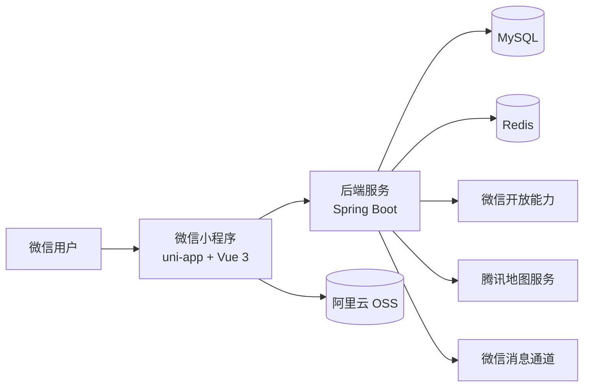

# lifeRecord

一个面向个人生活记录场景的微信小程序项目，包含 `uni-app + Vue 3` 小程序前端和 `Spring Boot` 后端，目标是提供一套可长期使用、可持续扩展的个人记录系统。

---

## 项目简介

`lifeRecord` 围绕“记录、回看、提醒、统计”四条主线展开，当前已覆盖：

- 日记记录
- 记账管理
- 打卡任务
- 纪念日管理
- 那年今日回忆
- 标签体系
- 回收站
- 微信提醒消息
- 定位与图片上传

项目采用前后端分离结构：

- `miniapp`：微信小程序前端
- `record`：Spring Boot 后端

---

## 功能模块

### 1. 日记模块

- 创建、编辑、删除、恢复、彻底删除
- 标题、正文、天气、心情、日期
- 图片上传、位置记录
- 标签关联
- 可见范围控制
- 点赞、评论
- 年龄文案展示

### 2. 记账模块

- 自定义账本
- 收入 / 支出流水
- 月度查询
- 标签统计
- 年度统计

### 3. 打卡模块

- 创建任务
- 每日打卡
- 按日期查看历史

### 4. 纪念日模块

- 创建、编辑、删除
- 每年重复
- 提醒时间配置

### 5. 提醒模块

- 主通道：小程序订阅消息
- 日记提醒
- 每日记账提醒
- 每月记账提醒
- 纪念日提醒

### 6. 回收站模块

- 日记进入回收站
- 记账流水进入回收站
- 支持恢复与彻底删除

### 7. 定位与媒体模块

- 当前定位
- 微信地图选点
- 腾讯地图逆地理编码
- OSS 路径存储

---

## 技术栈

### 后端

- Spring Boot
- Spring Security
- MyBatis-Plus
- MySQL
- Redis
- JWT
- Knife4j / OpenAPI

### 前端

- uni-app
- Vue 3
- TypeScript
- Axios

---

## 系统架构



---

## Quick Start

### 1. 启动后端

```bash
cd record
./mvnw.cmd spring-boot:run
```

常用检查命令：

```bash
cd record
./mvnw.cmd -q -DskipTests compile
./mvnw.cmd -q clean package
```

### 2. 启动前端

```bash
cd miniapp
npm install
npm run dev:mp-weixin
```

常用检查命令：

```bash
cd miniapp
npm run type-check
npm run build:mp-weixin
```

### 3. 环境配置

后端配置文件：

- `record/src/main/resources/application.yaml`
- `record/src/main/resources/application-dev.yaml`
- `record/src/main/resources/application-prod.yaml`

前端环境文件：

- `miniapp/.env.development`
- `miniapp/.env.production`

小程序配置文件：

- `miniapp/src/manifest.json`

---

## 项目结构

```text
lifeRecord/
  miniapp/                     # uni-app 微信小程序前端
  record/                      # Spring Boot 后端
  docs/
    architecture/              # 架构设计文档
    guide/                     # 发布、接入、配置指南
    standards/                 # 开发与提交规范
    assets/                    # 附件与补充文档
  README.md
```

后端模块目录约定：

```text
modules/<module-name>/
  controller/
  service/
  service/impl/
  mapper/
  model/
    dto/
    vo/
    entity/
```

---

## 文档入口

建议按下面顺序阅读：

1. [开发规范](./docs/standards/开发规范.md)
2. [提交规范](./docs/standards/提交规范.md)
3. [架构设计文档](./docs/architecture/architecture.md)
4. [发布配置清单](./docs/guide/发布配置清单.md)
5. [新手发布步骤](./docs/guide/新手发布步骤.md)
6. [小程序订阅消息和地图配置步骤](./docs/guide/小程序订阅消息和地图配置步骤.md)
7. [待办清单](./docs/assets/todo.md)

---

## 当前状态

### V1

- 已完成基础前后端骨架搭建
- 已打通登录、日记、记账、打卡、纪念日主链路
- 已完成小程序构建与后端打包

### V1.1

- 已完成提醒链路联调
- 已完成回收站与标签管理主流程
- 已完成真实环境验证：OSS 上传、地图选点、微信订阅提醒
- 已完成回收站策略收口：`Diary`、`LedgerEntry` 进入回收站；`CheckinTask`、`MemorialDay`、`LedgerBook` 不进入回收站
- 已完成 `ledger_entry.deleted_at` 真实数据库迁移
- 腾讯地图逆地理编码已接入服务端 `WebService API`

### V1.2

- 计划增加更多统计分析页面
- 计划完善分享与公开展示能力
- 计划继续提升整体使用体验与页面完成度

---

## 配置注意事项

- 腾讯地图服务端调试需要给对应环境的公网出口 IP 配置白名单
- `192.168.x.x` 这类内网地址不能作为腾讯地图服务端白名单
- 地图逆地理编码失败时不会再阻断日记主流程保存，但建议保持腾讯地图配置可用，方便补全 `province / city / district`

---

## TODO

- 补充正式页面截图
- 完善评论互动体验
- 完善提醒模板配置指引
- 增加更多统计分析能力
- 增加部署说明和环境变量模板

---

## 开发约定

- 全仓文本文件统一使用 `UTF-8`
- Java 源码使用 `UTF-8 without BOM`
- 换行统一使用 `LF`
- DTO / VO / Entity 需要补齐 `@Schema`
- `schema.sql` 需要补齐字段 `COMMENT`
- 提交前至少完成编译或构建检查
