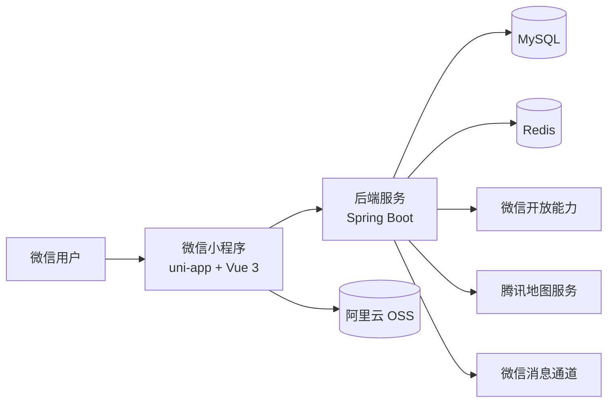
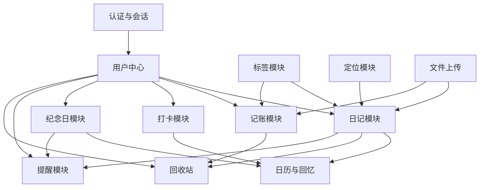

# lifeRecord

一个面向个人生活记录场景的微信小程序项目，包含 `uni-app + Vue 3` 小程序前端和 `Spring Boot` 后端，目标是提供一套可长期使用、可持续扩展的个人记录系统。

---

## 项目简介

`lifeRecord` 主要服务于日常生活记录场景，围绕“记录、回看、提醒、统计”四条主线展开，当前已经覆盖：

- 日记记录
- 记账管理
- 打卡任务
- 纪念日管理
- 去年今日回忆
- 标签体系
- 回收站
- 微信消息提醒
- 定位与图片上传

项目采用前后端分离架构：

- `miniapp`：微信小程序前端
- `record`：Spring Boot 后端

---

## 功能模块

### 1. 日记模块

- 创建、编辑、删除、恢复、强制删除
- 标题、正文、天气、心情、日期
- 图片上传、位置记录
- 标签关联
- 可见范围控制
- 点赞、评论
- 年龄文案展示

### 2. 记账模块

- 自定义账本
- 收入 / 支出流水
- 标签统计
- 年度汇总

### 3. 打卡模块

- 创建任务
- 每日打卡
- 日历状态聚合

### 4. 纪念日模块

- 创建、编辑、删除
- 每年重复
- 提醒时间配置

### 5. 提醒模块

- 主通道：小程序订阅消息
- 扩展通道：公众号模板消息

### 6. 定位与媒体模块

- 当前定位
- 手动选点
- 经纬度逆地理编码
- OSS 路径存储

---

## 技术栈

### 后端

- Spring Boot
- Spring Security
- MyBatis-Plus
- MySQL
- Redis
- JWT
- Knife4j / OpenAPI

### 前端

- uni-app
- Vue 3
- TypeScript
- Axios

---

## 系统架构图



---

## 模块关系图



---

## 登录与认证

当前项目使用微信小程序 `openid` 作为用户唯一标识。

登录流程：

1. 小程序前端调用 `wx.login`
2. 前端把 `code` 传给后端
3. 后端调用微信 `code2Session`
4. 后端获取 `openid`
5. 后端签发 `accessToken + refreshToken`
6. Redis 保存当前有效会话

会话策略：

- 单设备在线
- 新登录顶掉旧登录
- 旧 token 立即失效

---

## Quick Start

### 1. 克隆项目

```bash
git clone <your-repository-url>
cd lifeRecord
```

### 2. 启动后端

```bash
cd record
./mvnw.cmd spring-boot:run
```

常用检查命令：

```bash
cd record
./mvnw.cmd -q -DskipTests compile
./mvnw.cmd -q clean package
```

### 3. 启动前端

```bash
cd miniapp
npm install
npm run dev:mp-weixin
```

常用检查命令：

```bash
cd miniapp
npm run type-check
npm run build:mp-weixin
```

### 4. 环境配置

后端配置文件：

- `record/src/main/resources/application.yaml`
- `record/src/main/resources/application-dev.yaml`
- `record/src/main/resources/application-prod.yaml`

前端环境文件：

- `miniapp/.env.development`
- `miniapp/.env.production`

小程序配置文件：

- `miniapp/src/manifest.json`

---

## 项目结构

```text
lifeRecord/
  miniapp/                     # uni-app 微信小程序前端
  record/                      # Spring Boot 后端
  docs/                        # 项目文档
  .editorconfig                # 编辑器与编码规范
  README.md
```

后端模块目录约定：

```text
modules/<module-name>/
  controller/
  service/
  service/impl/
  mapper/
  model/
    dto/
    vo/
    entity/
```

---

## 文档入口

建议按下面顺序阅读：

1. [开发规范.md](/e:/01-server/lifeRecord/docs/开发规范.md)
2. [架构设计文档](./docs/architecture.md)
3. [发布配置清单.md](/e:/01-server/lifeRecord/docs/发布配置清单.md)
4. [新手发布步骤.md](/e:/01-server/lifeRecord/docs/新手发布步骤.md)

---

## Screenshots

当前仓库暂未整理正式截图，后续建议补充：

- 首页
- 日记列表页
- 写日记页
- 日记详情页
- 记账页
- 打卡页
- 个人中心页

如果后续补图，建议放到：

```text
docs/screenshots/
```

---

## TODO

- 补充完整页面截图
- 完善标签管理页面
- 完善评论互动体验
- 完善提醒模板配置指引
- 增加更多统计分析能力
- 增加部署说明和环境变量模板

---

## Roadmap

### V1

- 完成基础前后端骨架
- 打通登录、日记、记账、打卡、纪念日主链路
- 完成小程序构建与后端打包

### V1.1

- 完善提醒链路
- 完善回收站与标签管理
- 优化接口文档与模型说明

### V1.2

- 增加更多统计分析页面
- 完善分享与公开展示能力
- 提升整体使用体验与页面完成度

---

## 开发约定

- 全仓文本文件统一使用 `UTF-8`
- Java 源码使用 `UTF-8 without BOM`
- 换行统一使用 `LF`
- DTO / VO / Entity 必须补 `@Schema`
- `schema.sql` 必须写字段 `COMMENT`
- 提交前至少完成编译或构建检查

---

## 当前状态

当前仓库已经具备：

- 后端可编译、可打包
- 小程序可构建
- 核心业务主链路已打通

后续仍可继续增强：

- 更完整的评论互动
- 更完整的标签管理页面
- 更完善的提醒模板配置
- 更丰富的数据统计能力
