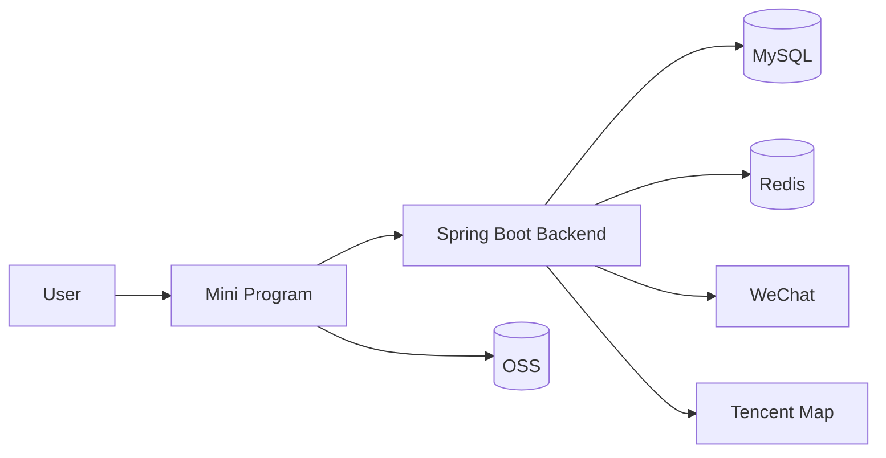

# Architecture Design

## 1. System Overview

The project uses a frontend-backend separated architecture:

- frontend: WeChat mini program for user interaction and page rendering
- backend: Spring Boot for business logic, authentication, persistence and external integrations

## 2. Architecture Diagram

## 3. Backend Layers

### Controller Layer

Responsible for:

- receiving requests
- validating request parameters
- returning unified response objects

### Service Layer

Responsible for:

- business logic
- permission checks
- cross-module orchestration

### Mapper Layer

Responsible for:

- database read and write operations
- persistence mapping

### Model Layer

Responsible for:

- `dto`: request payloads
- `vo`: response payloads
- `entity`: persistence entities

### Integration Layer

Responsible for:

- WeChat login
- mini program subscribe messages
- official account template messages
- map reverse geocoding
- OSS related support

## 4. Core Data Flow

### Login

The frontend calls `wx.login`, the backend exchanges the code for `openid`, then creates JWT tokens for its own business session.

### Diary

The frontend submits diary data, the backend writes the diary table, media table and tag relation table, and resolves structured address data when needed.

### Reminder

A scheduled task scans reminder settings. The main delivery path uses mini program subscribe messages, while official account template messages remain an optional extension path.

## 5. Storage

### MySQL

Used for:

- users
- sessions
- diaries
- tags
- ledger entries
- check-in tasks and records
- memorial days
- recycle bin records
- reminder settings and logs

### Redis

Used for:

- active login sessions
- token/session coordination

### OSS

Used for:

- image files
- video files

The database stores relative file paths or object keys only.

## 6. Design Principles

- keep user identity and business session separated
- separate file storage from business data
- keep module boundaries clear
- favor extensible data models
- keep API response format unified
- keep OpenAPI model annotations complete