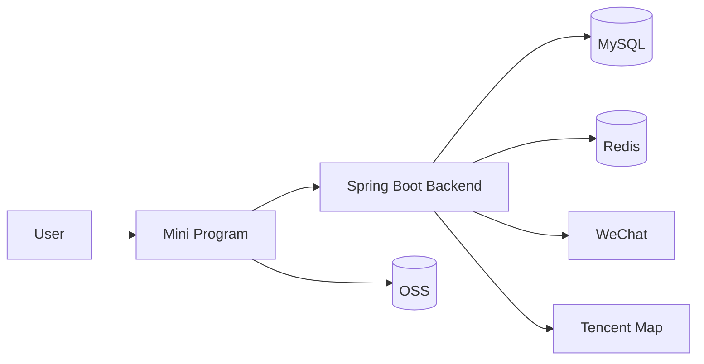

# 架构设计

## 1. 系统概览

本项目采用前后端分离架构：

- 前端：微信小程序，负责用户交互和页面渲染
- 后端：Spring Boot，负责业务逻辑、认证鉴权、数据持久化和外部能力集成

## 2. 架构图

## 3. 后端分层

### Controller 层

职责：

- 接收请求
- 校验请求参数
- 返回统一响应对象

### Service 层

职责：

- 承担业务逻辑
- 执行权限校验
- 协调跨模块流程

### Mapper 层

职责：

- 负责数据库读写
- 负责持久层映射

### Model 层

职责：

- `dto`：请求参数对象
- `vo`：响应结果对象
- `entity`：持久化实体

### 集成层

职责：

- 微信登录
- 小程序订阅消息
- 公众号模板消息
- 地图逆地理编码
- OSS 相关能力支持

## 4. 核心数据流

### 登录

前端调用 `wx.login`，后端使用 `code` 换取 `openid`，再生成 JWT 令牌，建立自身业务会话。

### 日记

前端提交日记数据后，后端会写入日记主表、媒体表和标签关联表，并在需要时补充结构化地址信息。

### 提醒

定时任务会扫描提醒设置。当前主发送链路是小程序订阅消息，公众号模板消息保留为可选扩展通道。

## 5. 存储设计

### MySQL

用于存储：

- 用户
- 会话
- 日记
- 标签
- 记账流水
- 打卡任务与记录
- 纪念日
- 回收站记录
- 提醒设置与日志

### Redis

用于存储：

- 活跃登录会话
- token / session 协调状态

### OSS

用于存储：

- 图片文件
- 视频文件

数据库中只保存相对文件路径或对象 Key。

## 6. 设计原则

- 用户身份与业务会话分离
- 文件存储与业务数据分离
- 保持模块边界清晰
- 优先采用可扩展的数据模型
- 保持 API 响应格式统一
- 保持 OpenAPI 模型注解完整
